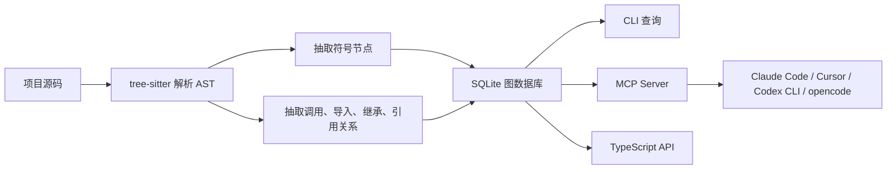

> 原文链接：https://www.cnblogs.com/tommymarc/p/20562646
> 抓取时间：2026-08-06 09:56:38
> 注：本文基于 CodeGraph 官方 README（2026-08 版）校订，命令、工具、benchmark 等事实陈述已对齐最新版本。

### CodeGraph 爆火：编程 Agent 需要的不是更多上下文，而是一张提前画好的代码地图

最近 GitHub 上有个项目涨得很猛：`colbymchenry/codegraph`。

你给到的榜单数据是：本周新增 Star `+15,909`，总 Star `19,392`。我又查了一圈公开信息，发现这个数字还在快速变化：第三方仓库统计站 GitGenius 在 2026 年 5 月下旬抓到的总 Star 已经超过 `20k`。这种短时间内的跳涨，通常说明它不只是“又一个 MCP 工具”，而是踩中了编程 Agent 当前非常具体的痛点。

这个痛点可以一句话概括：

> Agent 写代码之前，太多时间花在“找代码”上。

Claude Code、Cursor、Codex CLI、OpenCode 这类编程 Agent 在接手一个中大型项目时，第一件事往往不是改代码，而是反复调用 `grep`、`glob`、`Read`、`ls`，从文件名、函数名、调用链里一点点拼出代码结构。这个过程很像一个新同事入职第一天：不是不会写代码，而是不知道门在哪里、谁调用谁、改一个接口会碰到哪些地方。

CodeGraph 的思路很直接：不要让 Agent 每次都现场翻箱倒柜。先把代码库解析一遍，构造成一个本地知识图谱，再让 Agent 按结构查询。

项目地址：https://github.com/colbymchenry/codegraph

官方文档：https://colbymchenry.github.io/codegraph/

## 它到底是什么

CodeGraph 是一个本地优先的代码智能工具。它用一个 Rust 写的内核配合 tree-sitter 解析代码，把函数、类、方法、类型、路由、组件等抽成节点，把调用、导入、继承、引用等关系抽成边，然后存进本地 SQLite 数据库。

对开发者来说，它提供三种入口：

| 入口 | 用途 |
| --- | --- |
| CLI | 初始化、索引、查询、影响分析、生成上下文 |
| MCP Server | 接给 Claude Code、Cursor、Codex CLI、opencode、Hermes Agent、Gemini CLI、Antigravity、Kiro、GitHub Copilot |
| TypeScript API | 在自己的工具链里直接调用 CodeGraph |

最关键的一点是：它不是把代码丢给大模型总结，也不是把整个项目塞进向量库后做模糊召回。它的核心信息来自 AST 和静态结构，所以结果更接近“代码地图”，而不是“读后感”。

官方文档里对它的定位很清楚：本地运行、无 API Key、不依赖外部服务，数据存在项目目录下的 `.codegraph/` 里。

## 为什么它突然火了

这轮关注度并不是空穴来风。

在海外，CodeGraph 的传播点主要集中在三件事：

1. 它服务的是 Claude Code、Cursor、Codex CLI、opencode 这些正在高频使用的编程 Agent。
2. 它把“代码探索”从 Agent 的临时行为，前置成一次可复用的索引。
3. 它走 MCP 标准，可以作为一个本地工具服务器接入现有 Agent 工作流。

在中文技术圈，也已经有博客把它翻译和转述为“为 Claude Code 准备的预索引代码知识图谱”，重点强调“更少 Token、更少工具调用、100% 本地运行”。

这里要冷静看官方数据。

CodeGraph 的 README 给出了一组在 7 个真实开源代码库上的 benchmark（2026-08 重测，用 Claude Opus 4.8，每个仓库每臂跑 4 次取中位数）：VS Code（约 11k 文件）的工具调用从 `28` 次降到 `2` 次，Excalidraw 从 `43` 次降到 `2` 次，Alamofire 从 `33` 次降到 `4` 次；更关键的是，开启 CodeGraph 后这 7 个仓库的文件读取次数全部归零。汇总下来：工具调用减少 `88%`、速度快 `53%`、Token 减少 `62%`、成本低 `44%`。

这一轮测试还补上了之前缺失的一环：在对照组里也把 `codegraph` CLI 本身屏蔽掉，防止它绕过 MCP 被偷偷调用——README 直说早先没加这层屏蔽时公布的旧数据是不准的。

仍要提醒一句：benchmark 永远要看口径。具体百分比会受模型、提示词、仓库结构、任务类型影响。不要把它当成严格论文结论，而要看它揭示的工程事实：对于大项目，Agent 的“探索成本”真实存在，而且可以通过预索引显著下降。

## 工作原理：先解析，再查询



可以把 CodeGraph 理解成四层：

第一层是解析。它用一个 Rust 写的内核，配合 tree-sitter 从源码里解析出 AST，再根据不同语言的规则抽取函数、类、方法、类型、组件、路由等结构。

第二层是建图。函数调用、模块导入、类继承、接口实现、路由到 handler 的绑定关系，都会被记录成边。

第三层是存储。索引结果放在本地 SQLite 里（用 Node 内置的 `node:sqlite`，WAL 模式），并使用 FTS5 做全文搜索。

第四层是接入。CLI 给人用，MCP 给 Agent 用，TypeScript API 给工具链用。

这也是它和普通 `grep` 最大的区别。`grep` 能告诉你某个字符串出现在哪里，但它不知道这个字符串是一个函数定义、一次调用，还是注释里的随手一写。CodeGraph 试图回答的是更结构化的问题：

- `createOrder` 被哪些地方调用？
- 改 `UserService.login` 会影响哪些模块？
- 这个路由最终落到哪个 controller？
- 让 Agent 修一个登录 bug，需要给它哪些相关代码，而不是整个仓库？

## 支持范围

官方 README 显示，CodeGraph 目前支持 30 多种语言（其中 20 种走原生 Rust 解析，其余走可移植引擎，产出的图完全一致），包括：

| 类型 | 语言 |
| --- | --- |
| 前端和脚本 | TypeScript、JavaScript、ArkTS、Svelte、Vue、Astro、Liquid |
| 后端常见 | Python、Go、Rust、Java、C#、VB.NET、PHP、Ruby、Scala、Erlang |
| 系统和移动端 | C、C++、Objective-C、Metal、CUDA、Swift、Kotlin、Dart |
| 脚本和其他 | Lua、Luau、R、CFML、COBOL、Solidity、Terraform/OpenTofu、Nix、Pascal/Delphi |

它还做了框架路由识别，覆盖 17 个框架，包括 Django、Flask、FastAPI、Express、NestJS、Laravel、Rails、Spring、Gin、Axum、ASP.NET、Play、Vapor、React Router、SvelteKit、Vue/Nuxt、Astro 等。这个能力很实用，因为 Web 项目里“入口在哪里”经常不在函数名里，而在路由声明里。

## 实操：给一个项目接入 CodeGraph

下面这段是可照着跑的流程。建议先在一个中小型项目试，不要一上来就拿几十万行的大仓库压测。

### 1. 安装

CodeGraph 自带运行时，装的时候不需要本机有 Node.js。macOS / Linux 用一条 curl，Windows 用一条 PowerShell：

```bash
# macOS / Linux
curl -fsSL https://raw.githubusercontent.com/colbymchenry/codegraph/main/install.sh | sh

# Windows (PowerShell)
irm https://raw.githubusercontent.com/colbymchenry/codegraph/main/install.ps1 | iex
```

如果你本机已经有 Node，也可以走 npm：

```bash
npm install -g @colbymchenry/codegraph
```

装完之后，跑一次安装器把 CodeGraph 接到你的 Agent 上：

```bash
codegraph install
```

安装器会自动探测已装的 Agent（Claude Code、Cursor、Codex CLI、opencode、Hermes Agent、Gemini CLI、Antigravity、Kiro、GitHub Copilot），把 CodeGraph 的 MCP 服务写进它们的配置。注意这一步只接 Agent，不索引代码——建图是下一步 `codegraph init` 的事。

> 装完记得**开一个新终端**再继续，好让 `codegraph` 命令在 PATH 里生效。以后想升级就跑 `codegraph upgrade`，它会自动识别你是用脚本装的还是 npm 装的；想彻底卸载就跑 `codegraph uninstall`。

### 2. 初始化并自动同步

进入你的项目目录，一条命令建好图谱：

```bash
cd your-project
codegraph init
```

`init` 会创建 `.codegraph/` 目录，并在同一步里建好完整的图。和早期版本不同，现在**不需要手动 sync**：CodeGraph 默认开着文件 watcher（用系统原生的 FSEvents / inotify / ReadDirectoryChangesW），你保存文件后大约 2 秒内就会自动增量同步，索引永远不会过期。

如果你切了大分支、或者怀疑索引状态不对，可以强制重建：

```bash
codegraph index --force
```

只有少数情况才需要手动 `codegraph sync`：watcher 被禁用了（沙箱环境，或设了 `CODEGRAPH_NO_DAEMON=1`），或者你在 Agent 会话之外写脚本读索引、想开头先同步一次。

### 3. 看索引状态

```bash
codegraph status
```

这个命令会显示索引里的文件数、节点数、边数，以及数据库状态。新版 CodeGraph 自带运行时，用 Node 内置的 `node:sqlite`（WAL 模式）做存储，所以不再需要你手动装 better-sqlite3 这类原生模块，也没有 “native / wasm 后端” 的选择问题——一条命令装好就能用。

> 老版本（pre-0.9）才需要操心 better-sqlite3 的原生编译。如果你在很旧的安装上遇到 `database is locked`，重新装一次新版即可：`curl -fsSL https://raw.githubusercontent.com/colbymchenry/codegraph/main/install.sh | sh`（macOS/Linux）或 `irm https://raw.githubusercontent.com/colbymchenry/codegraph/main/install.ps1 | iex`（Windows）。

### 4. 查符号、调用链和影响范围

```bash
codegraph query UserService --limit 10
```

查谁调用了某个函数：

```bash
codegraph callers createOrder
```

查某个函数调用了谁：

```bash
codegraph callees createOrder
```

分析改动影响面：

```bash
codegraph impact createOrder
```

这几个命令适合人直接用，也适合在 Agent 改代码前先跑一遍。它们解决的是“我准备动这里，会不会牵出一串东西”的问题。

### 5. 给 Agent 一次性生成上下文

CodeGraph 还有一个很适合 Agent 的命令：`explore`。一条命令把相关符号的源码、调用路径和影响范围都拿出来：

```bash
codegraph explore "修复登录失败后没有刷新用户信息的问题"
```

它会围绕任务描述，返回一段按文件分组的相关源码，加上这些符号之间的调用关系（包括 grep 跟不上的动态分派）和改动的影响范围。相比让 Agent 自己从零开始翻文件，这种方式更像你提前把相关资料夹递给它。

`explore` 也是 CodeGraph 的 MCP 工具 `codegraph_explore` 在命令行的对应物——下面会讲到，MCP 端默认就只暴露这一个工具。

### 6. 只跑受影响的测试

affected 命令适合放进 CI 或 Git Hook。它会沿着依赖关系找出受改动影响的测试文件。

```bash
codegraph affected src/auth.ts src/user.ts
```

配合 git diff：

```bash
git diff --name-only | codegraph affected --stdin --quiet
```

一个简单的 CI 片段：

```bash
#!/usr/bin/env bash

AFFECTED=$(git diff --name-only HEAD | codegraph affected --stdin --quiet)

if [ -n "$AFFECTED" ]; then
  npx vitest run $AFFECTED
else
  echo "No affected tests found"
fi
```

这不是万能测试选择器，但对前端和 Node 项目里“改一个工具函数，到底该跑哪些测试”这种场景，思路是对的。

## 接入 Claude Code 的 MCP 配置示例

如果不走交互安装器，也可以手动配置 MCP Server。Claude Code 的配置思路大致如下：

```json
{
  "mcpServers": {
    "codegraph": {
      "type": "stdio",
      "command": "codegraph",
      "args": ["serve", "--mcp"]
    }
  }
}
```

CodeGraph 作为 MCP Server 后，默认只暴露**一个工具**：

| 工具 | 作用 |
| --- | --- |
| `codegraph_explore` | 一次调用回答几乎所有问题——“X 是怎么工作的”、某条调用链怎么走、或摸清某块代码的结构。返回相关符号按文件分组的源码、它们之间的调用路径（含动态分派），以及改动的影响范围 |

官方实测下来，给 Agent 一个强工具比给一排细分工具效果更好——少选错、每次会话还能省 context。其余命令（`codegraph_node`、`codegraph_search`、`codegraph_callers` 等）在 MCP 端默认隐藏，因为 `codegraph_explore` 已经把它们的输出都内联带回来了；需要的话可以用 `CODEGRAPH_MCP_TOOLS` 环境变量重新启用，或直接用对应的 CLI（`codegraph node` / `query` / `callers` 等）。

这里要注意 Cursor 的一个细节。官方集成文档提到，Cursor 启动 MCP 子进程时工作目录可能不符合预期。如果手动接入，最好显式传项目路径；如果用安装器，它会帮你处理这件事。

## TypeScript API 示例

如果你想把 CodeGraph 接进自己的内部工具，也可以直接用它的 TypeScript API。库 API 跑在你自己的运行时上，需要 **Node 22.5+**（用内置的 `node:sqlite`）；CLI 和 MCP 服务不受影响，它们跑在自带的运行时上。

```ts
import CodeGraph from "@colbymchenry/codegraph";

const projectPath = process.cwd();
const cg = await CodeGraph.init(projectPath);

await cg.indexAll({
  onProgress(progress) {
    console.log(`${progress.phase}: ${progress.current}/${progress.total}`);
  },
});

const results = cg.searchNodes("UserService");

if (results.length > 0) {
  const nodeId = results[0].node.id;

  const callers = cg.getCallers(nodeId);
  const impact = cg.getImpactRadius(nodeId, 2);
  const context = await cg.buildContext("修复登录状态刷新问题", {
    maxNodes: 20,
    includeCode: true,
    format: "markdown",
  });

  console.log({ callers, impact, context });
}

cg.watch(); // 文件变更时自动同步
cg.close();
```

这段代码适合做内部平台能力，比如：

- PR 页面自动展示某个核心函数的影响范围；
- 在 CI 里根据变更文件推荐测试范围；
- 给内部 Agent 提供稳定的代码结构查询接口；
- 做一个“代码库导航”页面，让新人按模块和调用链理解项目。

## 怎么在团队里用

我不会一开始就把 CodeGraph 当成“全项目必装”的基础设施。更稳妥的方式是从三个场景试起。

第一，老项目改 bug。尤其是调用链长、模块边界模糊、历史包袱重的项目。让 Agent 改之前先查 `callers`、`callees`、`impact`，可以减少它只看局部文件就动手的概率。

第二，大仓库问答。比如“订单创建流程从接口到落库怎么走”“这个缓存在哪里失效”“哪个入口会调用这个策略”。这类问题本质上不是生成代码，而是探索结构。CodeGraph 正好对口。

第三，CI 测试选择。`affected` 不一定能完全替代人工判断，但可以给测试执行做第一层过滤，尤其适合测试很多、全量跑很慢的仓库。

对 Agent 的提示词也要改一下。不要只说“帮我修 bug”，而要明确让它先用结构化工具：

```text
这个项目已经初始化 CodeGraph。
在修改代码前，请先使用 codegraph_explore 查找相关符号和调用路径，
确认影响范围后再动手。
只有当图谱结果不足时，再回退到 grep/read 读取文件。
```

这个提示不花哨，但很管用。它把 Agent 的第一反应从“扫文件”改成“查地图”。

## 需要注意的几个问题

第一，索引不是零成本。首次索引大项目会花时间，也会生成本地数据库。好消息是 CodeGraph 默认就会排除 `node_modules`、`dist`、`build`、`vendor` 这类依赖和构建目录，也尊重 `.gitignore`；想额外排除什么，加进 `.gitignore` 或在 `codegraph.json` 里用 `exclude` 配置即可。

第二，静态分析不等于运行时真相。动态导入、反射、依赖注入、运行时注册、框架魔法，都会让静态图谱有盲区。CodeGraph 能让 Agent 少走弯路，但不能保证覆盖所有真实调用。

第三，MCP 工具也要做权限管理。CodeGraph 暴露的是本地代码索引，虽然官方强调 100% 本地，但它仍然会让 Agent 更容易读取结构化代码信息。企业内部使用时，建议明确哪些 Agent 能接入、哪些仓库可以建索引、`.codegraph/` 是否允许提交。

第四，benchmark 要看口径。README 和文档里的数据都指向“工具调用和探索成本下降”，但具体百分比会受模型、提示词、仓库结构、任务类型影响。真正落地时，最好拿自己团队的两三个真实任务做 A/B 对比。

## 一句话总结

CodeGraph 火起来，不是因为它把 Agent 变聪明了，而是因为它把 Agent 最笨、最耗时的一步提前做掉了。

以前 Agent 进项目，先靠 `grep` 和 `Read` 自己摸路；现在你可以先给它一张由 AST、调用链、导入关系和路由关系组成的地图。地图不等于目的地，但在中大型代码库里，它能明显减少绕路。

如果你的团队已经在用 Claude Code、Cursor、Codex CLI 或 OpenCode，而且经常让 Agent 处理老项目、复杂调用链、大仓库问答，CodeGraph 值得单独拿半天试一下。

建议先从一个真实项目开始，不要看 Star 数上头，也不要只跑 demo。选一个最近刚修过的 bug，让 Agent 分别在有 CodeGraph 和没有 CodeGraph 的情况下回答：

```text
这个问题应该改哪些文件？
入口在哪里？
改动会影响哪些调用方？
需要补哪些测试？
```

如果它能少翻文件、少走弯路、少漏调用点，这个工具就有价值。
